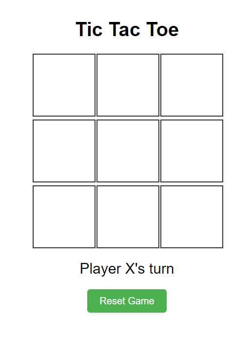
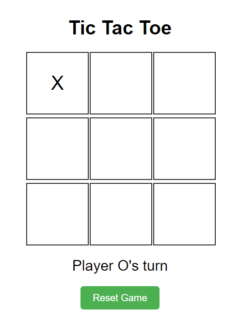
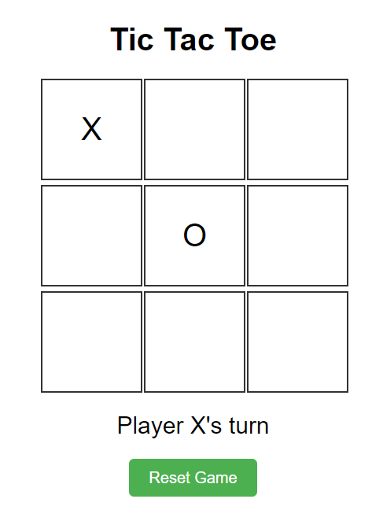
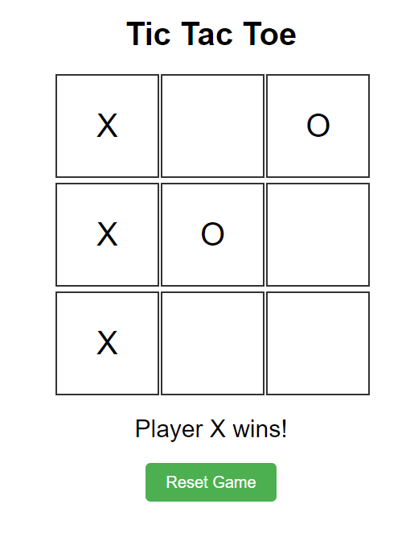
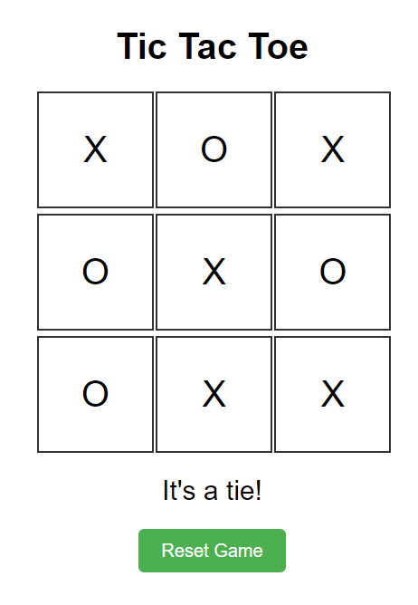

# Tik Tac Toe Game (Etienne Boutet)

## Documentation de l'implementation
[Système de design](docs/design_system.md)

## Règles du Jeu de Tic Tac Toe

Le Tic Tac Toe, est un jeu simple pour deux joueurs, X et O, qui marquent les espaces dans une grille de 3x3 alternativement. Le joueur qui réussit à placer trois de ses marques dans une ligne horizontale, verticale, ou diagonale gagne la partie.

### Début du Jeu

Le jeu commence avec une grille vide.

### Tour de Jeu

Les joueurs choisissent leur symbole (X ou O). Le joueur avec le symbole X commence généralement la partie.

#### Exemple de Premier Mouvement

Le joueur X place son symbole dans une case.

#### Réponse du Joueur O

Ensuite, le joueur O place son symbole dans une case vide.

### Comment Gagner

Un joueur gagne en étant le premier à aligner trois de ses symboles, soit horizontalement, soit verticalement, soit diagonalement.

#### Exemple de Victoire

Voici un exemple où le joueur X gagne la partie.

### Match Nul

Si tous les espaces sont remplis et qu'aucun joueur n'a aligné trois symboles, la partie se termine par un match nul.

